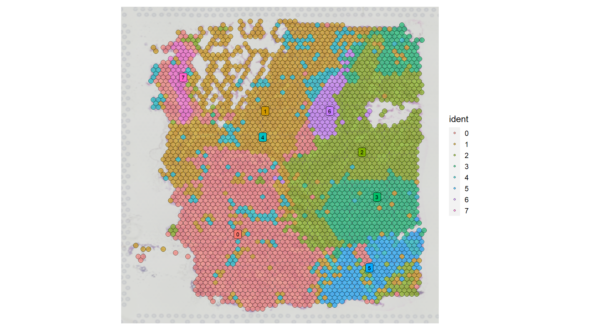
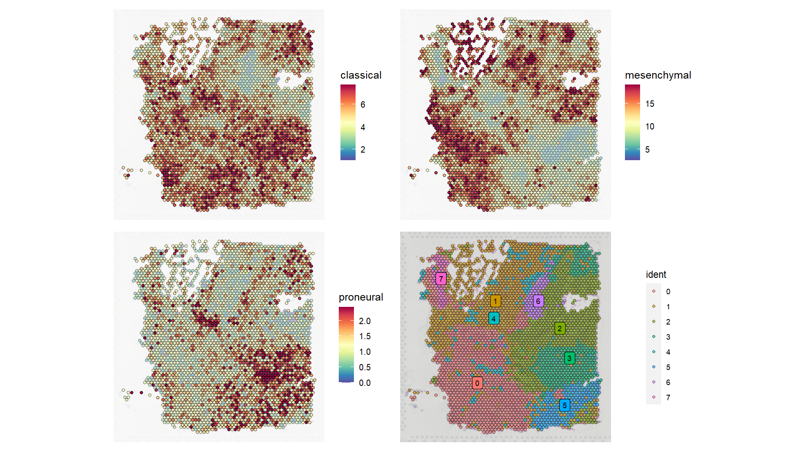

Workshop: single-cell and spatial transcriptomics analysis
================
Dr Kim Clarke

  
  

<br>
<p style="background-color:LightBlue;text-align:center;">
Please note: This was written for a computational biology course taken
by Masters students. It may contain a few references to other course
material/institute systems.
</p>

<br>

<div id="background" class="heading" style="text-align: center;">

## Background

</div>

Historically, a typical molecular biology experiment would aim to
measure the concentration of a particular molecule in a sample.
Typically, this would involve a researcher collecting the samples they
need, which could be a cell culture, a tissue biopsy, an entire organism
(for example: drosophila or c.elegans) and then extracting the type of
molecule they need to measure from that sample. They might then perform
a western blot, qPCR or omics experiment to generate data from that
sample. What we have done in this case is collapse the concentration of
a molecule in millions of cells down to a single representative value
for the sample as a whole. But what if some of the cells in your sample
contain a high concentration of your target molecule and some have
almost none at all? This type of information will be completely lost
with this “bulk” approach, but is exactly the type of information that
single-cell and spatial based technologies are designed to collect.
Single-cell technology started to emerge in around 2009 but has exploded
in popularity in the last 5 years due to the commercial availability of
biotechnology platforms to generate single-cell based data.

One field in which single cell technologies have excelled is cancer
biology. In the previous practical we compared subtypes of glioblastoma
using “bulk” gene expression data. In recent studies, it has been found
that this labeling of tumours into subtypes is actually more complex.
These types of tumours also contain blood vessels, immune cells and
other cells that make up the tumour micro-environment. Understanding the
heterogeneity and communication between these cell types is critical for
understanding the disease. With single-cell technologies, we can take a
tissue sample and generate a transcriptome for each cell, up to hundreds
of thousands of cells.

In this workshop, we will work through a basic analysis of some
single-cell RNA-sequencing data. We will look at how clustering and
dimensionality reduction techniques can be applied to reduce the
complexity of the analysis, and how this lets us investigate different
cell types. To do this we will use some data from cells isolated from a
brain tumour sample.

The second and third part of this workshop uses R to perform the
analysis and visualisation of the results. However, due to the
complexity of the analysis and the use of specialist R libraries, most
of the code has been provided for you. While working through the various
steps, focus on building an understanding of what each step achieves and
how that helps us with the interpretation of the data. I highly
recommend pausing and asking about/looking up any terminology or
concepts that are not clear, Google is a great starting point. Outside
of the workshops you can also contact the teaching staff on MS teams or
by email for further clarification.  
  
  
  

<div id="part1" class="heading" style="text-align: center;">

## Part 1 – A Prelude: Exploring single cell data online

</div>

<details>
<summary>
Exploring publicly available single-cell data online using CellBrowser
(click to expand)
</summary>

<br><br>We will start by looking at some data from the paper [Integrated
analysis of multimodal single-cell
data](https://doi.org/10.1016/j.cell.2021.04.048).

-   Open <https://cells.ucsc.edu/> in a browser (Chrome recommended).

You will see a list of datasets down the left hand side. These are all
single-cell sequencing experiments that have been uploaded to the
website for people to explore. We will look at some data from lymphocyte
and monocyte white blood cells first. These are commonly referred to as
PBMCs (peripheral blood mononuclear cells).

-   Where it says “filter datasets by organ”, type “blood” and hit
    enter.

-   Find the item “Multimodel PBMC” and click the Open button next to
    it.

In this case “multimodal” refers to the fact that the creators of the
data measured both mRNA and surface protein in each cell. We will just
look at the mRNA data today.

-   You will be presented with two options, click the “open” button next
    to “mRNA”.

You will be greeted by a screen filled with clouds of points in
different colours (it should look like Appendix A). Each tiny point is a
cell from blood of a healthy volunteer. As this is mRNA sequencing data,
each point represents a transcriptome for that cell. The expression of
between 501-5990 genes has been quantified for each cell in the dataset
(effectively, a table of data with 5990 rows and 161764 columns). This
has been processed using a set of techniques to summarise the data and
reduce the complexity. The visualisation of the cells in a 2D plot has
been achieved using UMAP (uniform manifold approximation and
projection), which takes highly complex, large datasets and tries to
summarise the differences between data points (in this case, cells).

The cells are colour coded according to the results of a clustering
process that tries to group together cells with similar transcriptomes.
Clustering can be more or less detailed according to your needs.

-   On the left hand side of the window, click where it says
    “celltype.l1”

The colour coding will change to a much simpler scheme with only 8
clusters. In the labels in the diagram and in the legend in the top
right you may recognise the names of some of the types of cells in the
immune system (B cells, NK cells, Monocytes, etc). In fact, we have the
entire cellular contents of blood including some platelets and a few red
blood cells that have snuck in (erythrocytes; Eryth). Just a note on
naming: cells are often referred to by type and which surface proteins
they are expressing, for example CD4 TCM means Central Memory T cells
expressing CD4 (CD4+). In many cases the different cell types can be
distinguished based on the genes that they express. Genes that are able
to distinguish between one cell type and another are referred to as
“markers”. Let’s look at a few potential markers.

-   Click the “Gene”tab in the top left of the window.

-   Enter ACTB in the “search for gene” box and hit enter.

After a few seconds you should see that the colour coding on the UMAP
diagram switches to show the expression level of ACTB in the cells. The
darker the colour, the higher the expression of ACTB mRNA in a cell, you
can see the scale on the right hand side of the window. ACTB encodes for
Beta-actin, a major constituent of cellular structures, and therefore we
should detect it in just about every cell, which we do (how many cells
had an ACTB value of 0?). ACTB would not make a very good marker for any
of these cell types.

-   Now search for APOBEC3A and hit enter.

You should see that this gene is only detected in a couple of clusters
of cells (CD14 Mono, CD16 Mono, we’ll ignore the cluster called
“Doublet” for now as it’s just a technical hiccup where more than 1 cell
gets into a droplet). This marker would not make a good marker for CD14+
Monocytes but it could be useful as a general marker to identify both
CD14+ and CD16+ Monocytes. It is common for specific cell types to be
identified using a combination of several markers. It is also common to
use markers to detect cells that are in a particular state, for example,
CD27 is used as a marker of memory B cells.

-   Search for FCGR3A and hit enter.

**Question: If you used APOBEC3A and FCGR3A as markers and only selected
cells that were positive for both, which cell type would you identify?**

Now we’re going to look at several combinations of genes that can be
used as markers in combination with others:

**Question: What cell populations are identified with the following
combinations of markers?**

(it’ll probably be easier to open both genes in 2 tabs in your browser)

**MS4A1 and IGHD**

**MS4A1 and IGHA1**

**CD8A and CCR7**

**CD8A and ITGAL**

**NKG7 without CD3D**  
  
  
  
</details>

<div id="part2" class="heading" style="text-align: center;">

## Part 2 – Analysing a single cell dataset in R

</div>

In the previous section we looked at a dataset that was hosted online.
Now, we’re going to load a single-cell gene expression dataset into R
and do our own exploratory analysis. Development of methods for
processing single-cell data has progressed rapidly in the last 10 years.
The most up-to-date techniques use cutting edge statistical algorithms
to get the most out of the data. We won’t be delving into the
methodology in this worksheet, but please feel free to ask about any
part you are interested in.

### Starting RStudio and loading R libraries

-   Start RStudio and make sure you have a new, blank session
-   Download the file data_for_workshop4.zip from Canvas and extract the
    contents into your working directory. Confirm that you have a new
    folder in your working directory called “data_for_workshop4”.
-   Install the single-cell analysis library `Seurat` using
    `install.packages("Seurat")`
-   Install the library `hdf5r` the same way, this will allow us to read
    the compressed spatial transcriptomics data.
-   Load the libraries below, make sure to check for any errors and
    install any that are missing using `install.packages( )`.
-   We will make our own theme for ggplot2 plots so that we don’t have
    to alter the settings when we make every plot. Create
    `my_theme`using the code below.

``` r
library(Seurat)
library(ggplot2)
library(dplyr)
library(patchwork)
library(tidyr)

my_theme = theme(text = element_text(size = 12), 
                 axis.text = element_blank(),
                 axis.ticks = element_blank())
```

### Loading the data

Continuing the trend of analysing data from Glioblastoma (GBM) brain
tumours, we are going to load some data published in 2019 in Cell ([link
to paper](https://pubmed.ncbi.nlm.nih.gov/31327527/)). In this study,
the diversity of cellular states in GBM was investigated using
single-cell RNA-sequencing. The data consists of thousands of cells in
which the expression of many genes has been quantified.

Single-cell sequencing data is big. In order to have a workshop that
will work on a wide variety of computers we will work on a subset of the
data corresponding to one patient. There is a chance that this is still
too intensive for your device, in which case I suggest using one of the
University PCs or a desktop PC if you have access to one at home. The
data has been provided for you in an RDS file, which is a special
compressed file format used by R to store data.

-   Load the data into a variable called `sc_data`

``` r
sc_data = readRDS("data_for_workshop4/seurat_obj_small_filt.rds")
```

-   Run `class(sc_data)`

That should tell you that the data is of class “Seurat”. It is common
for specialist libraries like `Seurat` to use their own data structures
for storing data and results. It is also common for basic R functions
like dim, length and colnames to work on these custom data structures.

-   Run `dim` and `colnames` on `sc_data`. `dim` will report the number
    of rows (genes) and columns (cells) (in that order), and `colnames`
    will give you the IDs of each cell in the data.

The actual gene expression data is buried deep within our custom Seurat
data structure (run `obj_small_filt@assays$RNA@counts[1:10,1:10]` to see
the first 10 rows and columns). Luckily, the Seurat toolkit comes with a
lot of functionality to perform the analysis without needing to write a
lot of code. The code has been packaged up into functions for us. Let’s
start by running some normalisation.

### Performing normalisation

One of the ways in which single-cell sequencing data can be biased is
that we don’t have control of how much data is collected for each cell.
The single-cell sequencing process may work very efficiently for one
cell but not for another, resulting in an artificial difference in the
total amount of gene expression we are able to measure in each cells.
Normalisation, in this case, is the process of correcting for that bias
to make all the cells comparable to each other.

-   We will use a method called SCTransform, which uses a type of
    regression analysis to remove the bias associated to technical
    variance. Run it now.

``` r
sc_data = SCTransform(sc_data)
```

### Running the dimensionality reduction processes: PCA and UMAP

As we saw in workshop 1 & 2, dimensionality reduction techniques can be
a useful tool in assessing the large-scale patterns that are present in
your data. These techniques go from useful to almost mandatory when you
scale up the data to the size of single-cell sequencing datasets. We
will apply two different dimensionality reduction techniques, PCA and
UMAP (uniform manifold approximation and projection). If UMAP sounds
complicated, that’s because it is, the original statistics paper
describing the method is 57 pages long. The key difference for the
end-user is that PCA will generate a set of new variables that describe
your data, with the only constraints being that these new variables must
be different from each other (uncorrelated) and will be less of these
new variables than features (genes) in your data. UMAP will also try to
capture the variation in your data in some new variables, but it will
only create two variables that you can use in a 2D scatter plot.

Importantly, neither UMAP or PCA is better than the other in all
situations. They both serve different purposes and should not be
directly compared in that way.

-   Use the Seurat library functions `RunPCA` and `RunUMAP` to add the
    results of the PCA and UMAP to your data object `sc_data`.

``` r
sc_data = RunPCA(sc_data)
sc_data = RunUMAP(sc_data, dims = 1:20)
```

-   Plot the results of your PCA analysis

``` r
FeaturePlot(sc_data, features = "nFeature_RNA", reduction = "pca", pt.size = 2) + 
  my_theme + 
  ggtitle("nFeature_RNA (genes detected per cell)")
```


<p>
<i>Figure 1 - The single cell transcriptomics data in principle
component space. Each point is a cell that has been colour coded
according to the number of genes detected in that cell.</i>
</p>

Here we use the Seurat function `FeaturePlot` to show the PCA scatter
plot. Each point is a cell that has been colour coded according to the
number of genes measured in each cell. You can see that there is quite a
large range (\~600-1500). This is typical of data generated using this
single-cell sequencing platform (from 10X Genomics Ltd), and is one of
the reasons why we need to be careful with how we normalise and process
the data. We can see that the number of genes measured in each cell does
seem to correlate with certain groups of points, but it’s not a dominant
factor influencing the position of the cells in the plot.

**Question: based on visual inspection of the PCA plot, what are your
conclusions?**

**If there are clusters, how many would you say there are?**

-   Next, let’s have a look at the UMAP scatter plot, run the same
    command as above but change where it says `reduction = "pca"` to
    `reduction = "umap"`.

You should see a roughly similar plot but with a few key differences.
First, we know that UMAP tries to capture all the variance in the data
in 2D, so we know that there aren’t additional variables after UMAP_1
and UMAP_2. Secondly, you will notice that the cells seem to be
separated into groups a bit more obviously than they were with the PCA.
The method underlying UMAP tends to introduce space between groups of
dissimilar cells, which is one of the reasons why it is such a popular
visualisation tool.


<p>
<i>Figure 2 - The single cell transcriptomics data in UMAP space. Each
point is a cell that has been colour coded according to the number of
genes detected in that cell.</i>
</p>

### Find clusters of similar cells

It can be useful to systematically identify similar groups of cells in
the data. This will greatly aid our downstream analysis by giving us an
objective criteria for defining groups of cells that we want to compare.
There are many methods for identifying clusters in data, each with its
own set of advantages and disadvantages. We will use a method based on
the concept of “nearest neighbours”. In non-technical terms, the method
aims to find groups of cells that are very similar to each other (they
express the same genes at the same levels) while being dissimilar to all
the cells outside of their group. In technical terms, it builds a shared
nearest neighbour network using k-nearest neighbours, then optimises a
modularity function over the network to determine clusters.

-   Let’s run the process and look at the results

``` r
sc_data = FindNeighbors(sc_data)
sc_data = FindClusters(object = sc_data, resolution = 0.15)
```

-   Now let’s use the same UMAP plot but this time colour code the cells
    according to the clusters

``` r
DimPlot(object = sc_data, group.by = "seurat_clusters", reduction = "umap", pt.size = 2) + my_theme +
  ggtitle("Clusters of cells")
```


<p>
<i>Figure 3 - UMAP projection where cells are colour coded by cluster
</i>
</p>

**Question: How well do you think the clustering has worked?**

If you want to change the clustering you can try increasing the
`resolution = 0.15` parameter and re-running the `FindClusters` command
(sensible values for this are normally between 0.1 and \~1) and then the
`DimPlot` command. Large values for resolution will try to split the
data into more clusters. Both overclustering and underclustering can
both make interpretation difficult, so it is worth spending a bit of
time finding a good compromise between the two (not just in single-cell
analysis but more generally too).

### Finding differentially expressed genes

Now that we have identified some clusters of cells in our data, we can
think about comparing the gene expression between them to learn about
the biological states of each cluster. First, we need to do the
statistical tests that will compare the expression of each gene in each
cluster to the rest of the cells, and then identify genes that have a
statistically significant change in expression. Seurat has a built in
function to do this called `FindAllMarkers`, which uses the Wilcoxon
Rank Sum test by default. It is common for people used to single-cell
analysis to refer to genes as markers for some applications. Once we
have identified the significant markers, we will apply an additional
filter to ensure that we only keep markers with a highly significant
p-value and a positive fold change (you can probably identify the line
of code that does this below).

-   Run the code below to generate the list of markers, filter out
    non-significant markers, and then write each list of markers to a
    text file in your working directory.

``` r
markers = FindAllMarkers(sc_data)

for(i in unique(markers$cluster)){
  
  marker_subset = markers %>% filter(cluster == i, p_val_adj < 0.01, avg_log2FC > 0.5)
  write.table(marker_subset, 
              file = paste0("significant_marker_genes_for_cluster_", i, ".txt"),
              sep = "\t",
              row.names = FALSE,
              quote = FALSE)
  
}
```

You should now have several new files in your working directory called
e.g. `significant_marker_genes_for_cluster_1.txt`. These files will look
like the example below:

| p_val    | avg_log2FC | pct.1 | pct.2 | p_val_adj | cluster | gene    |
|----------|------------|-------|-------|-----------|---------|---------|
| 2.26E-29 | 1.2947     | 0.956 | 0.601 | 3.26E-25  | 0       | CAMK2N1 |
| 1.67E-28 | 1.1039     | 1     | 0.767 | 2.41E-24  | 0       | VAMP5   |
| 3.29E-28 | 1.1851     | 0.995 | 0.757 | 4.73E-24  | 0       | S100A16 |

The column headings are as follows:

**p_val**: p-value representing the significance of the differential
expression

**avg_log2FC**: the average size of the difference in expression between
this cluster and all the other cells (in log2 scale)

**pct.1**: the percentage of cells in this cluster in which expression
of this gene was detected

**pct.2**: the percentage of cells outside this cluster where expression
of this gene was detected

**p_val_adj**: the p-value after adjusting for multiple testing (Type I
error)

**cluster**: the identifier for the cluster (usually numeric starting at
0)

**gene**: the gene symbol identifier for each gene

If you think back to our UMAP plot, one of the clusters was particularly
far away from all the others.

-   Open the file associated to that cluster in Excel.

-   Sort the table by “avg_log2FC” so that the largest values are at the
    top of the table. This is the average log2 fold change, or the size
    of the change in expression.

-   Make a note of the gene with the highest value.

-   Repeat this process for the other clusters.

These genes may make good markers for our clusters, they are certainly
statistically significant, but let’s visualise the expression of these
genes in the cells in case we spot anything unusual.

1.  Where it says `genes_to_plot = c("","","","")` below, fill in the “”
    quotes with your gene names and remove the \# from the start of the
    line. You may have more or less genes to plot if you changed the
    clustering resolution. Then run the code below.

``` r
# genes_to_plot = c("", "", "", "")
p = FeaturePlot(object = sc_data, features = genes_to_plot, max.cutoff = "q95", combine = F, pt.size = 0.5)
Reduce(f = "+", lapply(p, function(p)p + my_theme + scale_color_distiller(type = "seq", direction = -1, palette = "Spectral")))
```


<p>
<i>Figure 4 - Expression of potential representative markers of each
cluster. Expression value: log1p(counts) </i>
</p>

**Question: Are all of the genes you chose good markers for their
clusters? If not, can you use the table of markers to find a better
one?**

### Functional Enrichment Analysis

Now that we have a list of genes that are significant markers for each
cluster, we can apply more general analysis techniques that can tell us
more about the biological state of the cells in each cluster. We will
use the DAVID web tool that we used in week 3 to look at the functions
of the genes associated to each cluster. In the interest of time, you
can focus on just a couple of the clusters that appear to be more
separated if you want.

-   Open the table of marker genes for each cluster in Excel and copy
    the column of gene symbols to your clipboard.

-   Open the DAVID website (david.ncifcrf.gov) and upload those genes in
    the same way we did in week 3.

**Question: does the analysis provided by DAVID tell you anything about
the potential types of cells making up each cluster?**

**Can you go as far as to confidently assign a cell type (even a very
broad category) to any of the clusters?**

You could also try searching for some of the markers on databases, for
example: <https://panglaodb.se/> or
<http://biocc.hrbmu.edu.cn/CellMarker> are both repositories for
cell-type markers (not all genes will give a clear result, use with
caution).

### Scoring each cell using the Glioblastoma subtype signatures from Verhaak et al (2010)

During this four-week block of LIFE752 we have tried to keep a running
theme of using data from Glioblastoma (GBM) brain tumours. In week 2 we
saw how different subtypes of GBM (classical, mesenchymal, proneural)
could be identified using gene expression data. This research placed
each patient within one of the different subtypes based on the
expression of a set of genes. However, recent work using single-cell
technologies has revealed there is a high degree of heterogeneity within
GBM and assigning a single subtype may be misleading.

A common task in single-cell gene expression analysis is to calculate a
score for each cell based on a “signature”. In this case, a signature is
just a list of genes that are predictive of a given molecular state. We
can use the genes identified by Verhaak et al as being linked to each
subtype to score each cell according to how much it matches each GBM
subtype signature. Mathematically, this is fairly straightforward, we
add up all the expression of the genes in each signature for a given
cell and that is the set of scores for that cell. The code below loads a
table containing the gene IDs associated to each subtype, then uses the
`PercentageFeatureSet` function to add a score to each cell for each
subtype. We then plot a UMAP colour coded by the scores and a “violin
plot” showing the scores in each cluster.

-   Run the code below (if the plots are very small on your screen you
    can open it in a new window with the “zoom” button just above the
    plot panel in RStudio).

``` r
sigs = read.delim("data_for_workshop4/gene_subtype_association_table.txt")
sigs = tapply(sigs$symbol, sigs$assoc_subtype, function(x)x)

sc_data = PercentageFeatureSet(object = sc_data, features = intersect(sigs$CL, VariableFeatures(sc_data)), col.name = "classical", assay = "SCT")
sc_data = PercentageFeatureSet(object = sc_data, features = intersect(sigs$MES, VariableFeatures(sc_data)), col.name = "mesenchymal", assay = "SCT")
sc_data = PercentageFeatureSet(object = sc_data, features = intersect(sigs$PN, VariableFeatures(sc_data)), col.name = "proneural", assay = "SCT")

p1 = FeaturePlot(sc_data, features = c("classical","mesenchymal","proneural"), max.cutoff = "q95", combine = F, pt.size = 1)
p2 = VlnPlot(sc_data, features = c("classical","mesenchymal","proneural"), combine = F)
Reduce(f = "+", lapply(p1, function(p)p + my_theme)) + Reduce(f = "+", lapply(p2, function(p2)p2 + my_theme + theme(legend.position = "none"))) + plot_layout(ncol = 2)
```

**Question: Would you be able to assign a subtype to this tumour based
on these results?**


<p>
<i>Figure 5 - Scoring each cell using the Glioblastoma subtype
signatures. Cells are colour coded according to the score for each
signature. Scales are equal to the percentage of total counts in each
cell attributed to that signature.</i>
</p>

  
  
  
  

<div id="part3" class="heading" style="text-align: center;">

## Part 3 - Spatial Transcriptomics

</div>

The “method of the year” from 2020, spatial transcriptomics aims to
combine imaging/microscopy with RNA-sequencing to determine gene
expression while preserving the structure of the tissue. You can think
of this data as very similar to the single-cell sequencing data, but
each data point is a region in a tissue section instead of a single cell
(a section is a very thin slice of tissue). Each region may contain 10s
to 1000s of cells depending on the technology used but the premise is
the same: the resolution is small enough that you can distinguish the
gene expression patterns across very small structures within the tissue.

We are going to look at some spatial transcriptomics data from a GBM
patient that has been profiled using the 10X Genomics Visium platform.
The data is available from the 10X Genomics website. First, let’s have a
look at the image of the tissue section.

-   You should have a folder called “spatial” in your
    “data_for_workshop4” directory containing some images. Open the file
    “tissue_hires_image”.

Low-res version for display on github:<br>

<br>

This is a digital photograph of a section from part of tumour biopsy. We
can see that there is a part that might be damaged (top left), but there
is plenty of intact tissue. In a real research project we might also
have some staining data (IHC) using antibodies against known cell types,
nuclei, immune cells, proteins of interest, etc, but for this example we
will just look at the gene expression data.

In the interest of time we will combine some of the steps needed to get
the data ready into larger blocks of code.

### Load the data, normalisation, dimensionality reduction, clustering

-   Run the code below to perform all the steps necessary before further
    analysis. Conceptually, these steps are virtually identical to the
    previous section, but instead of cells we have regions on the tissue
    section.

``` r
brain = Load10X_Spatial(data.dir = "data_for_workshop4", filename = "Targeted_Visium_Human_Glioblastoma_Pan_Cancer_filtered_feature_bc_matrix.h5",filter.matrix = F)
brain <- SCTransform(brain, assay = "Spatial", verbose = FALSE)
brain <- RunPCA(brain, assay = "SCT", verbose = FALSE)
brain <- FindNeighbors(brain, reduction = "pca", dims = 1:30)
brain <- FindClusters(brain, verbose = FALSE, resolution = 0.3)
brain <- RunUMAP(brain, reduction = "pca", dims = 1:30)
```

### Diagnostic plots

Let’s see how many genes we were able to measure in each region of the
tissue section

-   Create the spatial feature plot which will overlay the information
    on top of the image of the tissue section.

``` r
SpatialFeaturePlot(brain, features = "nFeature_Spatial") + theme(legend.position = "right")
```


<p>
<i>Figure 6 - Regions where gene expression was detectable, mapped to
the image of the tissue section. Colour coding indicates the number of
genes detected in each region.</i>
</p>

Not bad, it looks like we were able to capture an average of about 400
genes in each region. This is far from perfect, ideally we would measure
10,000+ genes in each region, but the technology is still in it’s
infancy.

### Genes that show high variation

As part of the normalisation process, genes are scored according to how
much they differ across the different regions. We can have a look at the
top of this list to visualise a few of the genes with the highest
variance. I have selected six genes to get started, but you can use
`VariableFeatures(brain)[1:20]` to show the names of the top 20 most
varying genes if you want to have a look at others.

-   Create the gene expression plots using the code below. This code
    uses some more advanced R (`Reduce`) to apply a new theme (altered
    legend position and reduced text size) to all the plots at once.

``` r
feats = c("CD74", "CD14", "CD86", "VEGFA", "CCNA1", "MYC")

Reduce(f = "+", lapply(SpatialFeaturePlot(brain, stroke = 0, pt.size.factor = 2, image.alpha = 0.5, 
                                          features = feats, 
                                          alpha = c(0.2, 1), 
                                          max.cutoff = "q95", 
                                          combine = F), function(p)
                                            p + scale_fill_distiller(palette = "Spectral", ) +
                         theme(legend.position = "right", text = element_text(size = 10))))
```


<p>
<i>Figure 7 - A selection of genes with the highest variation across the
whole dataset. Points are colour coded according to expression of each
gene (log1p counts).</i>
</p>

We can see from these plots that we can capture a range of different
spatial expression patterns. From genes detected in a clear pattern but
in nearly every region (CD74), to very localised, small areas (CCNA1,
MYC), to genes that are on the limit of detection but which might
correlate with more obvious patterns (CD86 correlates with ?).

CD74, CD14, CD86: These genes are expressed by immune cells including
Dendritic Cells, Macrophages and B cells. These regions are likely to
have a high level of immune cells present.

VEGFA: A growth factor that stimulates angiogenesis (generation of new
blood vessels).

CCNA1: A regulator of the cell cycle, highly expressed in cells
enterying S Phase (DNA replication). These regions are likely to contain
a high number of actively cycling cells.

MYC: A powerful transcription factor that controls many downstream
processes and is commonly dysregulated in cancer.

### Visualising the spatial clustering

In the same manner as the single-cell sequencing data, we can apply
clustering to our spatial data to objectively identify and group similar
regions based on the gene expression data.

-   Plot the clusters using the `SpatialDimPlot`command below.

``` r
p2 = SpatialDimPlot(brain, label = TRUE, label.size = 3, alpha = 0.6, image.alpha = 0.5, pt.size.factor = 2, label.color = "black")
p2
```


<p>
<i>Figure 8 - Identification of clusters of regions.</i>
</p>

### Score each region using the gene signatures from Verhaak et al

Finally, let’s revisit our GBM subtypes one last time. In the
single-cell sequencing data we saw how cells scored highly for different
subtypes within the same sample. Let’s see if we can confirm that
observation using the spatial transcriptomics data.

-   Run the code below. Remember that you can “detach” your plot from R
    Studio if you want to view it full-screen.

``` r
brain = PercentageFeatureSet(object = brain, features = intersect(sigs$CL, VariableFeatures(brain)), col.name = "classical", assay = "SCT")
brain = PercentageFeatureSet(object = brain, features = intersect(sigs$MES, VariableFeatures(brain)), col.name = "mesenchymal", assay = "SCT")
brain = PercentageFeatureSet(object = brain, features = intersect(sigs$PN, VariableFeatures(brain)), col.name = "proneural", assay = "SCT")

p3 = SpatialFeaturePlot(brain, features = c("classical","mesenchymal","proneural"), ncol = 2, image.alpha = 0.1, alpha = c(0.3, 1), max.cutoff = "q95", combine = F, pt.size.factor = 2, stroke = 0)
p3 = Reduce(f = "+", lapply(p3, function(p3)p3 + theme(legend.position = "right") + my_theme)) + p2
```


<p>
<i>Figure 9 - Scoring each region using the Glioblastoma subtype
signatures. Scales represent the percentage of expression in each region
attributable to that signature.</i>
</p>

### Plot the subtype scores in selected clusters

It looks like some of our clusters might correspond to regions with very
different subtype scores. We can plot the scores for each subtype in a
cluster using a boxplot and “jittered” points. To make the scores
comparable to each other we will need to standardise the scores by
dividing each subtype score by the sum total score of all regions for
that subtype. Keep in mind that this is just for visualisation purposes.

-   Look at the panel of plots from the previous section. Focus on the
    mesenchymal and classical subtypes. Pick two clusters that you think
    show the greatest difference in subtype scores. Enter the numbers
    (separated by a comma) between the brackets in the code below where
    it says `clusters_to_plot = c()`, then remove the \# at the start of
    the line and run all the code below.

``` r
# clusters_to_plot = c()

# standardise scores
df = data.frame(region = colnames(brain), 
                classical = brain$classical, 
                mesenchymal = brain$mesenchymal, 
                proneural = brain$proneural, 
                cluster = brain$seurat_clusters)
df = df %>% mutate(classical_norm = classical/sum(classical), 
              mesenchymal_norm = mesenchymal/sum(mesenchymal), 
              proneural_norm = proneural/sum(proneural))

df = pivot_longer(data = df, cols = c(classical_norm, mesenchymal_norm))
df = df %>% filter(cluster %in% clusters_to_plot)

ggplot(df, aes(x = name, y = value, color = cluster)) + 
  geom_boxplot() + 
  geom_jitter() + 
  facet_wrap(facets = vars(cluster), nrow = 1) + 
  theme_bw()  + 
  theme(axis.text.x = element_text(angle = 90),
        text = element_text(size = 14)) + 
  xlab("Cluster") + 
  ylab("Standardised signature score")
```


<p>
<i>Figure 10 - Normalised signature scores for three clusters. Classical
and mesenchymal scores are shown for indicative purposes.</i>
</p>

You should see that the standardised subtype scores are quite different
in these clusters!

## Summary

Hopefully you will have started to reach the same conclusion that
researchers around the world have come to in recent years, Glioblastoma
is a highly heterogenous disease and in fact you can find [multiple
sub-types within the same
tumour](https://www.pnas.org/content/110/10/4009.short). This type of
information is valuable, and daunting, to those developing targeted
therapeutic approaches.

As single-cell technology matures over the next decade, we will
undoubtedly be able to apply it to answer some of the major unanswered
questions across all facets of molecular biology. Any biological problem
where cell-cell communication occurs in a heterogenous microenvironment
may benefit from single-cell and spatial analysis technology. In tandem
to single-cell RNA sequencing, genomics, epigenomics and proteomics are
all beginning to enter the single-cell resolution ballpark. The [dataset
we looked at in part 1](https://doi.org/10.1016/j.cell.2021.04.048)
simultaneously measured the transcriptome and expression of 228 cell
surface proteins in 211,000 single-cells, giving us a glimpse at the
type of datasets that will be routinely available in the future. Being
able to analyse this type of data will be a valuable skill.
